# Laboratório Virtual de Phishing

## Sobre o projeto

Este projeto documenta uma simulação educacional de phishing realizada em um laboratório autorizado, como parte da formação em Cibersegurança da DIO.

O objetivo é compreender o funcionamento desse tipo de ataque, reconhecer seus riscos e estudar medidas de identificação e prevenção.

## Objetivos

- Preparar um ambiente controlado para testes;
- Validar a comunicação entre as máquinas virtuais;
- Estudar o funcionamento do SEToolkit no Kali Linux;
- Executar uma simulação utilizando somente dados fictícios;
- Registrar evidências técnicas do laboratório;
- Apresentar medidas de prevenção contra phishing.

## Ambiente utilizado

| Componente | Configuração |
|---|---|
| Hipervisor | VMware Workstation |
| Máquina de segurança | Kali Linux |
| Máquina cliente | Windows 11 Pro — WINLAB11 |
| IP do Kali | `173.168.100.75` |
| IP do WINLAB11 | `173.168.100.1` |
| Ferramenta estudada | Social-Engineer Toolkit — SEToolkit |
| Controle de versão | Git |

## Topologia

```text
Kali Linux                         WINLAB11
173.168.100.75  <------------->  173.168.100.1

```

A comunicação entre as duas máquinas foi validada nos dois sentidos, sem perda de pacotes.

## Regras de segurança

O experimento possui finalidade exclusivamente educacional e foi executado em equipamentos autorizados.

- Uso exclusivo de dados fictícios;
- Nenhuma credencial verdadeira será utilizada;
- Nenhum terceiro participará do teste;
- Nenhum serviço será publicado na internet;
- Nenhuma página será enviada a pessoas externas;
- O Firewall do Windows permanecerá ativo;
- O ambiente será desativado após o laboratório.

> As máquinas estão temporariamente conectadas à mesma rede local. O experimento será limitado aos equipamentos autorizados e não será exposto externamente.

## Evidências iniciais

### Comunicação do Kali com o WINLAB11

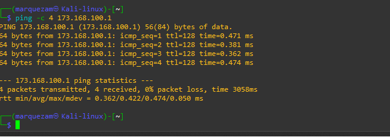

### Regra de firewall para o laboratório

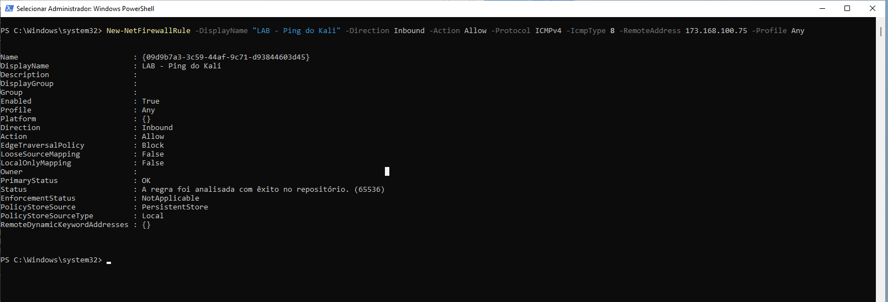

### Comunicação do WINLAB11 com o Kali

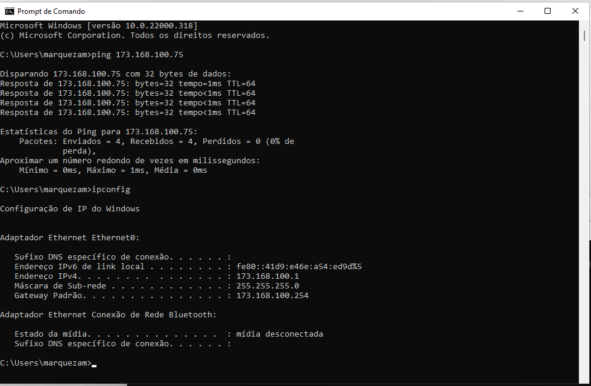

### Máquina virtual WINLAB11

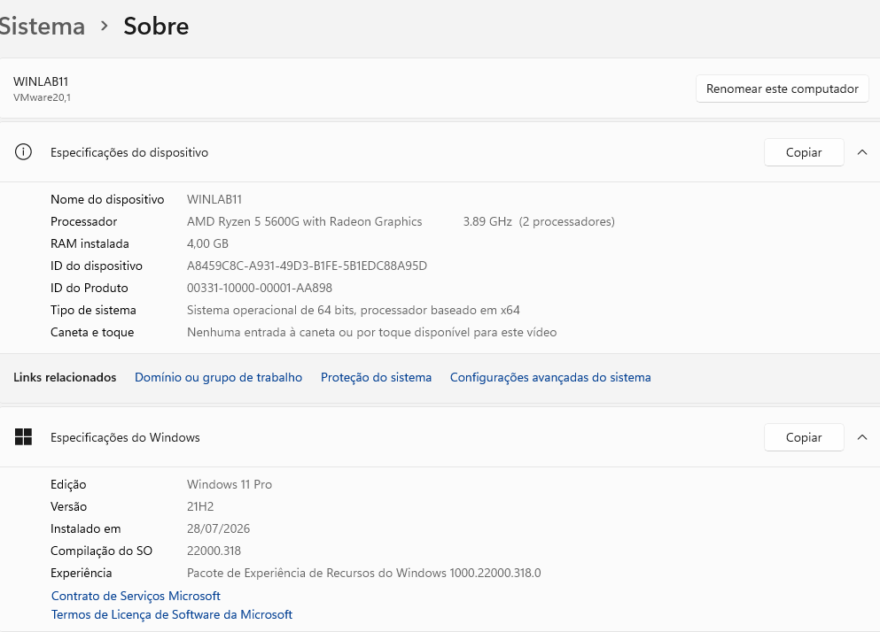

## Estrutura do repositório

```text
laboratorio-virtual-phishing/
├── README.md
├── docs/
├── evidencias/
├── lab-site/
└── images/
```

## Progresso

- [x] Preparação do Kali Linux;
- [x] Preparação do WINLAB11;
- [x] Configuração da comunicação de rede;
- [x] Validação da conectividade;
- [x] Organização das evidências iniciais;
- [x] Inicialização do repositório Git;
- [x] Execução da simulação educacional;
- [x] Registro dos resultados;
- [x] Documentação das medidas preventivas;
- [ ] Publicação do projeto no GitHub.

## Uso responsável

Este projeto não incentiva ataques contra terceiros. Seu propósito é demonstrar, em ambiente autorizado, como o phishing funciona e como usuários e organizações podem reconhecer e evitar essa ameaça.


## Relatório técnico completo

A execução detalhada, incluindo ambiente, comandos, diagnóstico, limitações, decisões e medidas preventivas, está disponível em:

- [Relatório técnico do laboratório](docs/relatorio-tecnico.md)
- [Resultado sanitizado do Credential Harvester](evidencias/resultado-harvester-sanitizado.md)

## Procedimento executado

O fluxo original solicitado pela atividade foi reproduzido:

1. `Social-Engineering Attacks`;
2. `Website Attack Vectors`;
3. `Credential Harvester Attack Method`;
4. `Site Cloner`;
5. IP de retorno `173.168.100.75`;
6. URL `http://www.facebook.com`.

O Facebook redirecionou a requisição para `login.facebook.com` e recusou o download automatizado com `HTTP 400`.

O SEToolkit foi atualizado da versão `8.0.3` para `8.1.3`, mas o comportamento permaneceu.

Para concluir a demonstração sem contornar as proteções do serviço externo, foi utilizada uma página local de treinamento, importada pelo recurso `Custom Import`.

## Resultado

O Credential Harvester foi iniciado na porta TCP `80`. O WINLAB11 acessou a página educacional, enviou um formulário com dados fictícios e o SEToolkit identificou corretamente os campos de usuário e senha.

Após o envio, o navegador foi redirecionado para o endereço oficial do Facebook.

Os valores submetidos e o relatório XML bruto não foram incluídos no repositório público.

## Evidências da execução

### Menu principal do SEToolkit

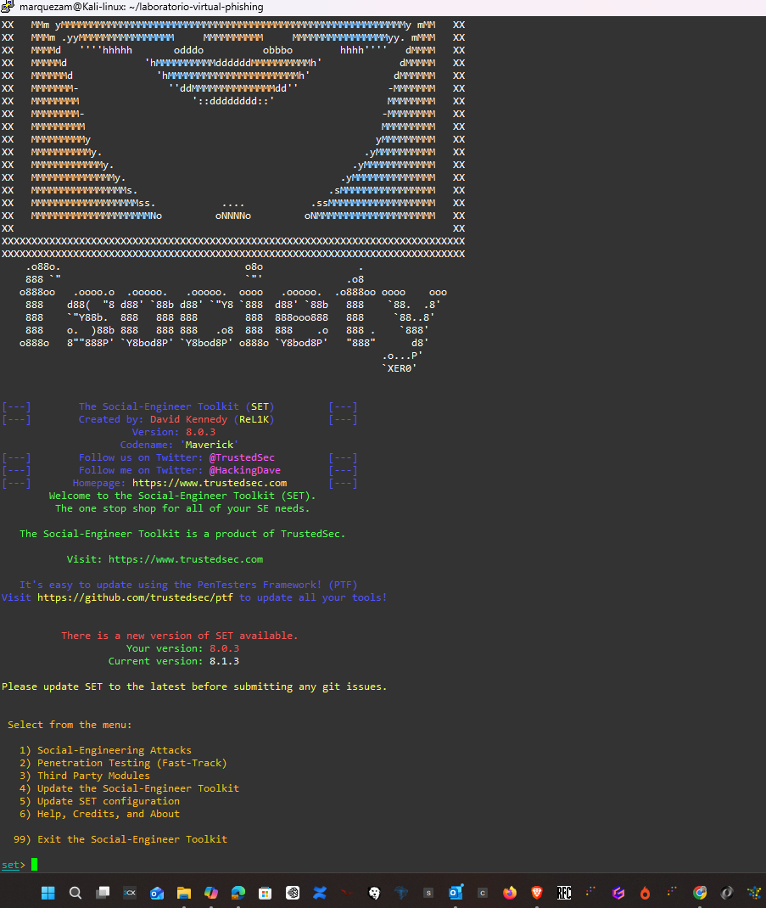

### Seleção de Social-Engineering Attacks

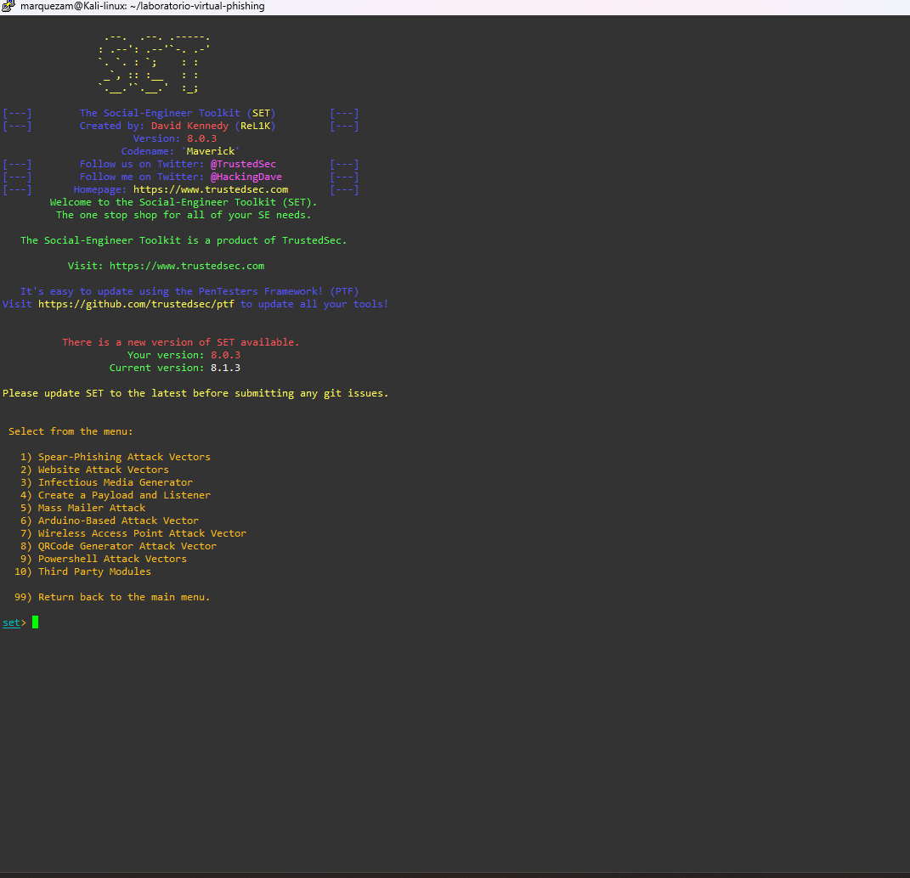

### Seleção de Website Attack Vectors

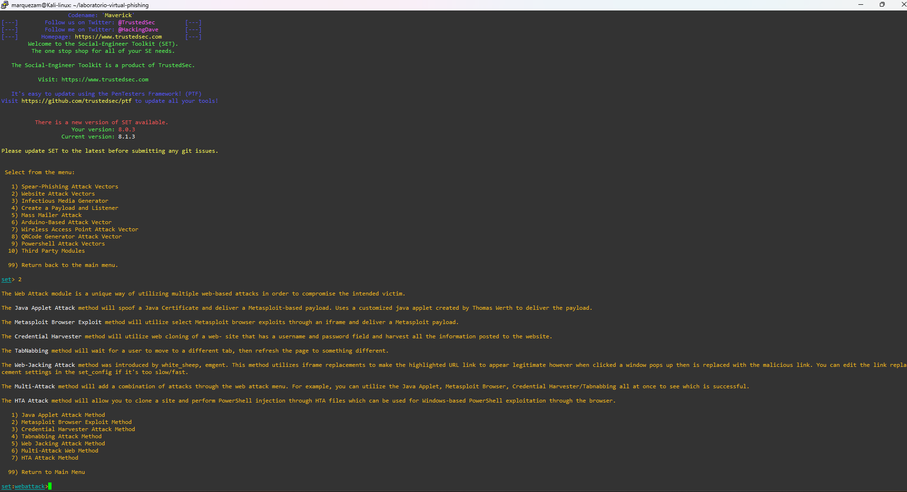

### Seleção do Credential Harvester

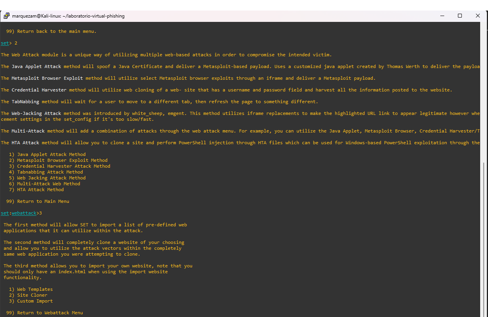

### Configuração do IP de retorno

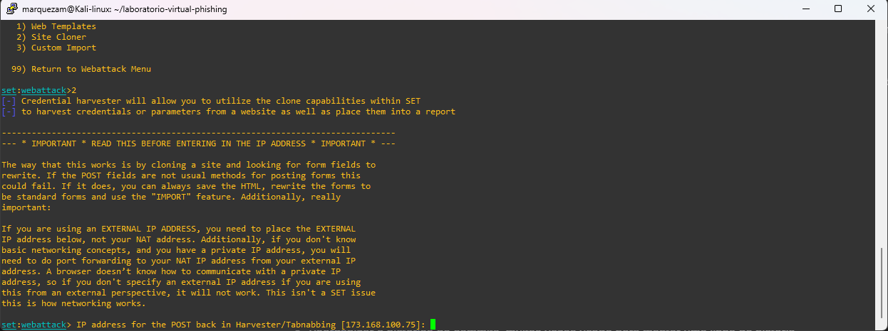

### URL original informada ao Site Cloner

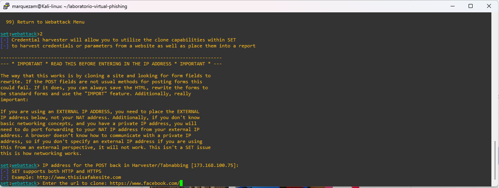

### Falha atual do Site Cloner

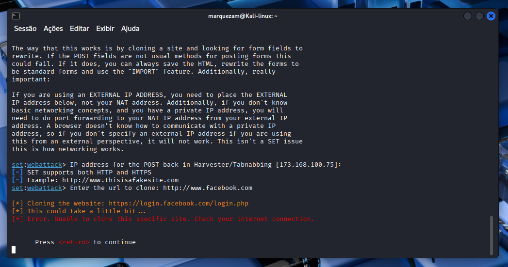

### SEToolkit atualizado para 8.1.3

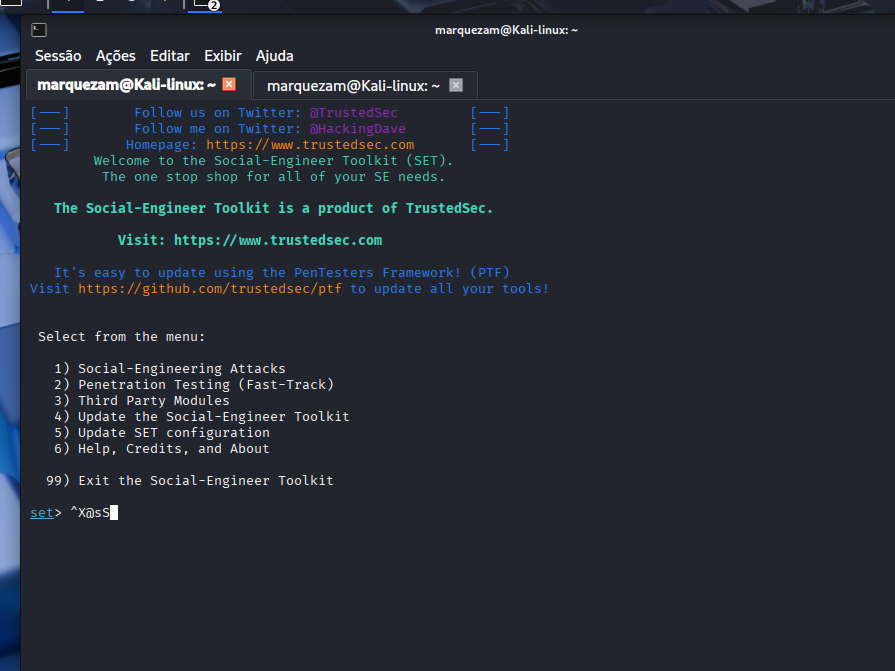

### Credential Harvester executando na porta 80

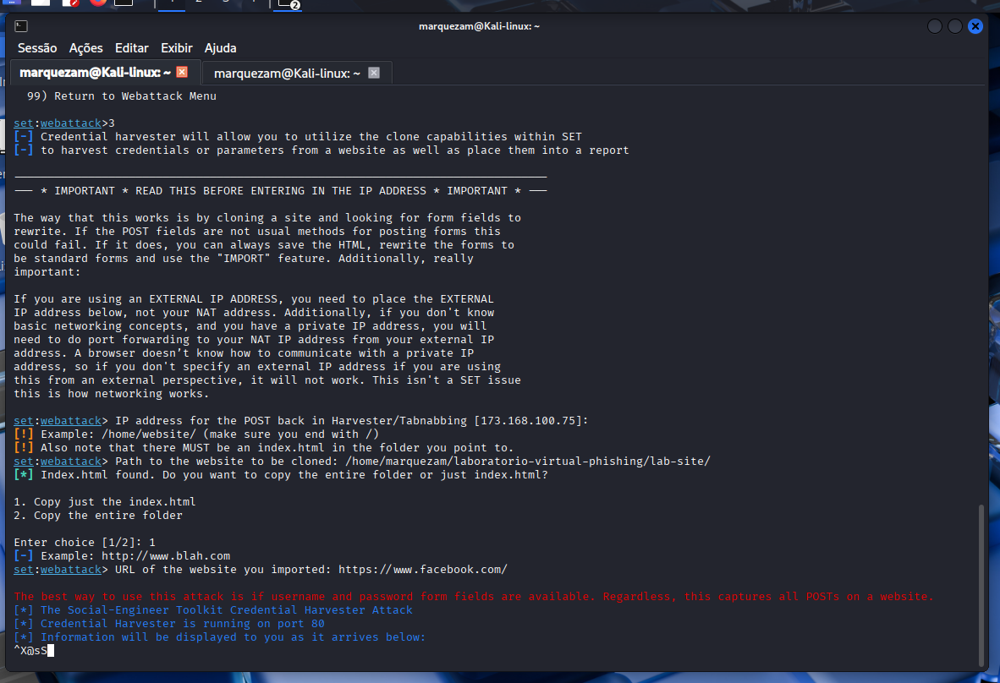

### Página educacional no WINLAB11

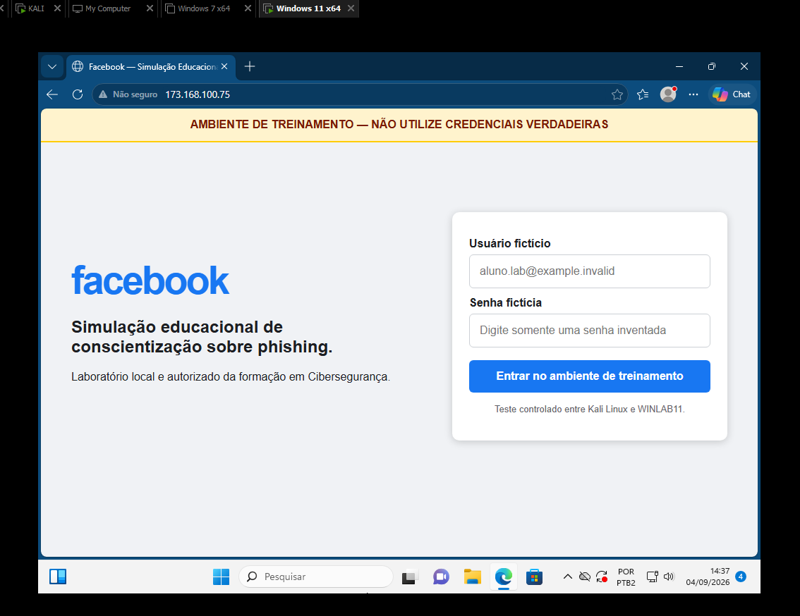

### Redirecionamento para o Facebook oficial

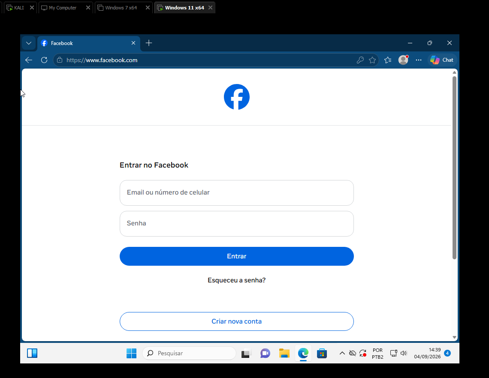

## Principais aprendizados

- funcionamento do Credential Harvester;
- diferença entre requisições GET e POST;
- função do endereço de retorno;
- importância da porta TCP `80`;
- limitações de ferramentas diante de páginas modernas;
- necessidade de validar mensagens genéricas de erro;
- importância de atualizar as ferramentas;
- uso de Git para documentar decisões técnicas;
- tratamento responsável de dados capturados;
- necessidade de autorização formal em testes de segurança.
